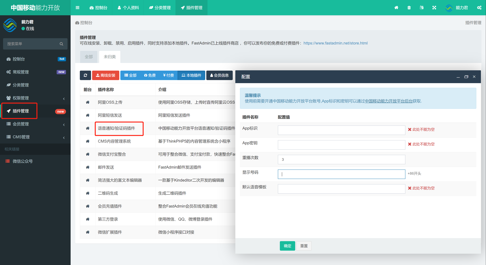

# 语音通知/语音验证码插件

<div align="center">
    
</div>

### 插件说明

本插件用于FastAdmin框架,用于快速对接中国移动能力开放平台语音通知产品,仅配置必要参数即可完成对接.

使用前请先开通中国移动能力开放平台相关账号与产品,点击查看相关[语音产品](https://cmccopen.cn/aep/consumerCapDetail.html?apiPackageId=00000000-0000-0000-0000-500300128000).

### 功能预览


### 使用说明

下载插件代码并将`cmcctts`文件夹复制到项目根目录的`addons`目录下

打开项目后台在本地插件列表找到本插件并配置相关参数



完成配置后即可点击插件标题打开示例页面测试配置结果

**代码调用示例:**

```

$cmcctts = new \addons\cmcctts\library\Cmcctts();
$ret = $cmcctts->template($template)->cmccVoice($mobile,$param);
if ($ret) {
    $this->success("操作成功");
} else {
    $this->error("操作失败！失败原因：" . $cmcctts->getError());
}

```

> 详细内容参考插件目录下controller/Index.php文件


### 特别感谢

FastAdmin:[https://github.com/karsonzhang/fastadmin](https://github.com/karsonzhang/fastadmin)

中国移动能力开放平台:[https://cmccopen.cn/](https://cmccopen.cn)

### 版权信息

本插件遵循Apache2开源协议发布，并提供免费使用。

